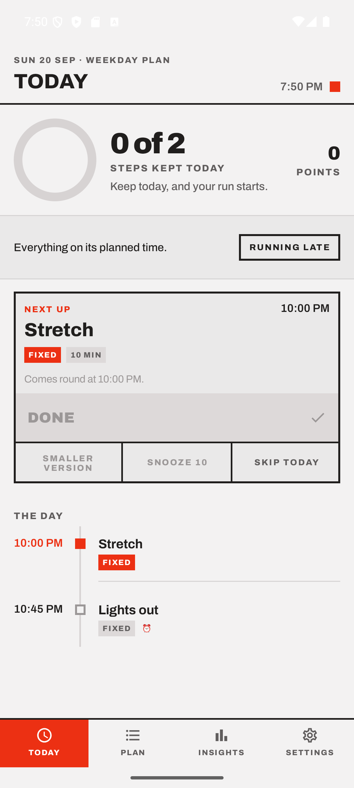
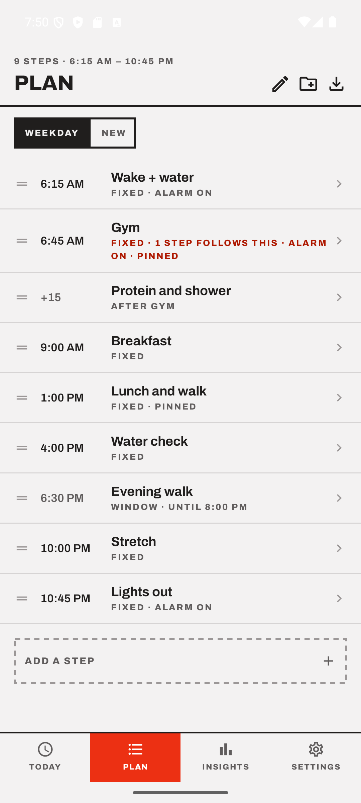
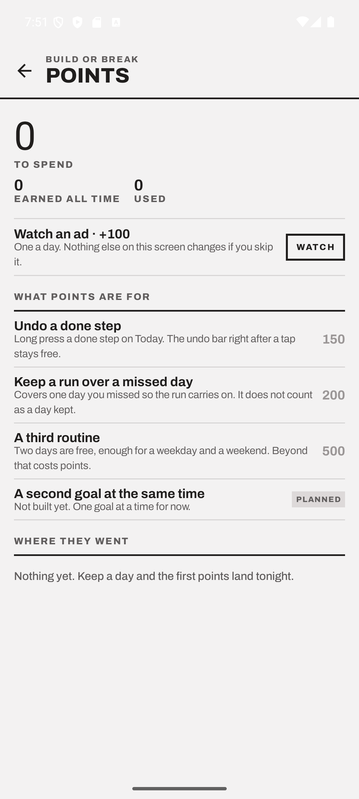

# Build or Break

An Android routine app that runs your day and reshapes it when the day moves.

Most habit apps record what you did. This one tries to get it done: it holds
your routine, rings at the right minute, and when you fall behind it moves the
rest of the day for you and tells you what it moved.

Everything stays on the phone. No account, no server, no analytics, and no
internet permission.

<p align="left">
  
  
  
</p>

## Why I am building this

I am trying to gain weight, and I kept missing things. Not the hard parts. The
small ones. Weighing myself before I drank water. Taking a shake when work ran
over and the afternoon disappeared.

So I went looking for an app that would run the routine rather than record it
afterwards. Routinery gets closest, but it binds every step to a fixed clock
time, and that is also the loudest complaint in its own reviews: if your day
starts at six on Monday and eight on Saturday, you end up maintaining two
routines or living permanently out of sync. Loop and the other open source
trackers are checkbox grids with reminders. The AI ones write you a plan and
then leave you alone at the part that is actually difficult.

None of them bend. So I am building the one I wanted.

## What it does

**Runs a plan you already have.** It does not generate one. Paste in whatever
you wrote, or whatever an AI tool wrote for you, and this schedules and
executes it.

**Four kinds of timing.** A step can sit at a fixed clock time, hang off the
step before it, float inside a window, or repeat on an interval. Move one and
the ones that depend on it move with it.

**Day templates.** Office day, work from home, rest day, sick day. One tap in
the morning reshapes the whole timeline.

**A smaller version of every step,** written in advance. On a bad day the
notification offers the shorter one instead of nothing.

**Snooze that shows you the cost.** Moving one step tells you which later steps
move with it, before you commit.

**Whole day shift.** Woke up ninety minutes late, move the day, and keep the
gym slot where it is because it is booked.

**A goal your days add up to,** measured on a seven day average with a pace
line, so one heavy meal does not look like progress and one light day does not
look like failure.

**Insights and a written weekly review** that names the win, the problem and
the one question worth answering.

**Points.** A kept day is worth points, and points buy back an undo, a streak
that survives a missed day, or a third routine. Nothing is taken away for a bad
day.

**A backup that reads back.** One file with the plan, the history, the goal,
the readings and the badges, shared anywhere and restored from anywhere.

**English and Hindi, light and dark,** a tablet layout, and every control
reachable with a screen reader.

## Status

In progress, and used daily on one phone. There is no public build yet, so
there is nothing to install.

**What works end to end:** the timeline engine and its four anchor types, day
templates, the whole day shift and the snooze preview, the tiered scheduler
with full screen alarms and its delivery audit, the daily close, goals with a
seven day average and a pace line, the weekly review and Insights, import from
pasted text, backup and restore, points with a ledger, the nine badges,
English and Hindi, light and dark.

**What does not exist yet:** anything paid, the ads SDK behind the "watch an
ad" button, multi week programs, and everything to do with the store listing.

## The hard part

Not the AI, and not the UI. It is getting an alarm to fire at 08:00 on a Redmi.

Android makes this genuinely difficult, and it has got harder rather than
easier. Exact alarms are denied by default from Android 14. Full screen intents
are auto granted only to calling and alarm apps since January 2025. Both are
restricted permissions that need a Play Console declaration. On top of the
platform, most of the phones people actually own in India ship a battery manager
that will quietly kill a background app unless the user has found an autostart
toggle three menus deep.

The approach here is to never assume a capability. The scheduler detects what it
is allowed to do at runtime and degrades in tiers, from a full screen alarm down
to an inexact notification, down to in app only. The app tells you which tier it
is on and exactly which two settings would move it up.

Every scheduled alarm also writes an audit row with what time it was supposed to
fire and what time it did. That produces a real number rather than a claim, and
that number goes here once there is enough of it.

## Architecture

```
app/                UI shell, navigation, feature packages
core/model          pure JVM, data types
core/domain         pure JVM, the timeline engine
core/common         pure JVM, TimeProvider, dispatchers
core/testing        pure JVM, shared fixtures
core/data           Room, DataStore, repositories
core/designsystem   tokens, theme, components
scheduler/          alarms, notifications, foreground service, receivers
billing/            entitlements, billing SDK isolated here
widget/             Glance widget
benchmark/          macrobenchmark, baseline profile
```

Four of those are Kotlin JVM modules rather than Android libraries. That is
deliberate. The timeline engine cannot import Android even by accident, which
means the whole day resolution logic is a set of pure functions that test in
milliseconds without an emulator. Detekt also fails the build on any direct call
to `Instant.now`, so the clock is always injected and time is always
controllable in a test.

A few rules the code keeps to, because they are what stop the app drifting:

- A ViewModel never touches Room, DataStore or AlarmManager, and never
  computes. It holds facts, not sentences.
- Every user visible string lives in `values/strings.xml`, with a Hindi
  translation beside it. The design system owns no copy.
- Derived numbers are derived. The points score is a pure function of the
  rows the daily close already writes, so it cannot disagree with them.

Kotlin, Compose with Material 3, Room, Hilt, Navigation 3, Glance. Android only,
minSdk 26, targetSdk 36.

## Building it

Needs JDK 17 and an Android SDK with API 36.

```bash
./gradlew :app:assembleDebug     # a debug APK
./gradlew :app:installDebug      # build and install on a connected device
./gradlew qualityCheck           # spotless, detekt and every unit test
```

The device suite is a single walkthrough that drives the app through a real
day. It reads English copy, so pin the app's locale first:

```bash
./gradlew :app:installDebug
adb shell pm clear com.buildorbreak.app.debug
adb shell cmd locale set-app-locales com.buildorbreak.app.debug --user 0 --locales en-US
./gradlew :app:connectedDebugAndroidTest
```

`qualityCheck` is the gate. It runs ktlint through Spotless, detekt with the
project's own thresholds, and the full unit suite, with warnings as errors.

## Why Android only

iOS has no exact alarm API. Local notifications cap at 64 pending, get silenced
by Focus and by the ringer switch, and the Critical Alerts entitlement is not
granted for this category. The core promise of the app cannot be kept there, so
I would rather not ship a worse version of it than pretend.

## Reading the code

The repository is public so that the privacy claim can be checked rather than
believed: there is no network call in here to find, and `scheduler/` is the
part worth reading if you are fighting the same battle with Doze and OEM
battery managers.

It is public to read, not to reuse. No licence is granted, so all rights are
reserved for now. If you want to build on any of it, ask.
